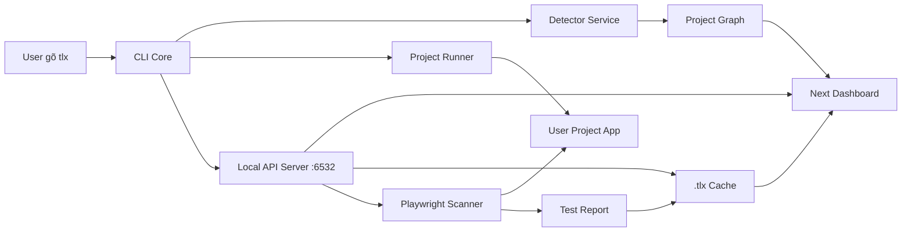
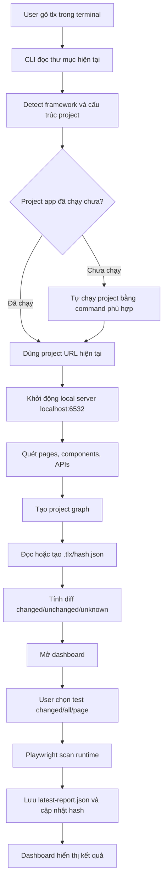
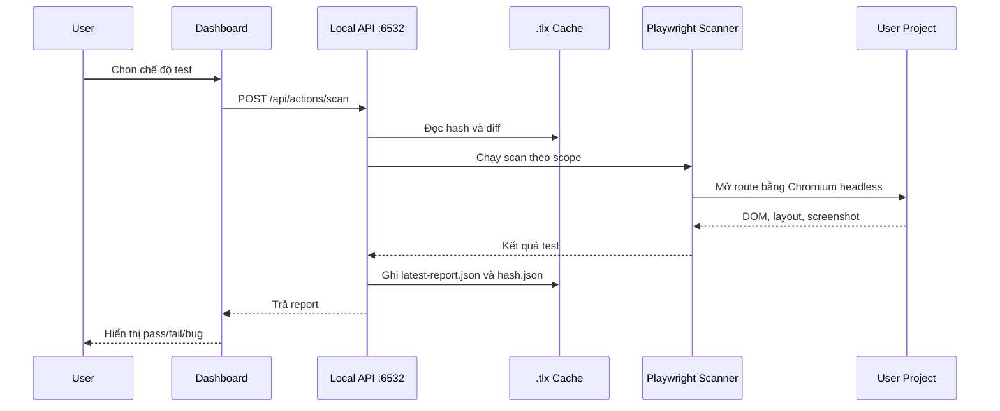

# SRS - TLX Local v1

## 1. Giới thiệu

### 1.1. Mục tiêu dự án

TLX Engine là công cụ **Local-First UI/UX Testing & Mapping** dành cho developer. Mục tiêu của phiên bản Local v1 là giúp user chỉ cần gõ lệnh `tlx` trong terminal, sau đó TLX tự nhận diện dự án, tự chạy dự án nếu cần, quét cấu trúc giao diện và mở dashboard để user kiểm tra trực quan.

TLX tập trung vào ba giá trị chính:

- Tự động hóa bước nhận diện dự án, chạy dự án và quét cấu trúc page/component/API.
- Hiển thị bản đồ dự án trên dashboard để user dễ hiểu page nào dùng component nào, page nào gọi API nào.
- Dùng cache `.tlx` và hash file để tránh test lại những phần không thay đổi.

### 1.2. Đối tượng sử dụng

- Developer frontend/backend đang làm việc trực tiếp trên máy local.
- Sinh viên hoặc team nhỏ cần công cụ kiểm thử UI/UX nhanh, dễ demo, không phụ thuộc cloud.
- Người review pull request muốn biết thay đổi code ảnh hưởng tới page/component/API nào.

### 1.3. Phạm vi v1

Phiên bản v1 chỉ tập trung vào local workflow:

- Chạy bằng lệnh chính `tlx`.
- Nhận diện framework/project từ thư mục hiện tại.
- Tự chạy project nếu project chưa chạy.
- Mở dashboard local tại `http://localhost:6532`.
- Quét pages, components, APIs và dựng graph gửi lên dashboard.
- Cho phép user chạy test từ dashboard.
- Tạo và sử dụng folder `.tlx/` để lưu hash, report và ảnh chụp nếu có.

### 1.4. Ngoài phạm vi v1

Các tính năng sau chưa phải yêu cầu bắt buộc của v1, chỉ nằm trong roadmap:

- Cloud SaaS workspace.
- RBAC, billing, multi-tenancy.
- AI UX Consultant.
- Auto-Fix PR Bot.
- GitHub Action hoặc CI/CD marketplace.
- Dashboard graph trực tiếp trong CLI terminal.

## 2. Cấu trúc dự án hiện tại

Repo hiện tại là monorepo dùng Bun workspace, gồm hai app chính:

- `apps/cli`: CLI TypeScript, dùng Commander để khai báo lệnh, Express để serve API/dashboard, Playwright để scan runtime, Tree-sitter để parse source.
- `apps/ui`: Dashboard Next.js, dùng App Router để hiển thị giao diện local.

```text
tlx/
├── package.json
├── bun.lock
├── tsconfig.json
├── tsconfig.base.json
├── tlx.yaml
├── TLX.md
├── srs.md
├── apps/
│   ├── cli/
│   │   ├── package.json
│   │   ├── tsconfig.json
│   │   ├── tests/
│   │   │   └── detector-strategies.test.ts
│   │   └── src/
│   │       ├── index.ts
│   │       ├── commands/
│   │       │   └── ui.command.ts
│   │       ├── controllers/
│   │       │   └── action.controller.ts
│   │       ├── server/
│   │       │   ├── index.ts
│   │       │   └── routes.ts
│   │       ├── services/
│   │       │   ├── detector.service.ts
│   │       │   ├── engine.service.ts
│   │       │   └── parser.service.ts
│   │       └── strategies/
│   │           ├── next.strategy.ts
│   │           ├── vue-vite.strategy.ts
│   │           ├── laravel.strategy.ts
│   │           ├── php.strategy.ts
│   │           ├── types.ts
│   │           └── utils.ts
│   └── ui/
│       ├── package.json
│       ├── next.config.ts
│       └── app/
│           ├── layout.tsx
│           ├── page.tsx
│           └── globals.css
└── .tlx/
    ├── hash.json
    ├── latest-report.json
    └── screenshots/
```

Ghi chú: `.tlx/` là folder được TLX tạo trong project của user khi chạy, không nhất thiết là folder có sẵn trong repo TLX.

## 3. Kiến trúc tổng quan

TLX Local v1 gồm các khối chính:

- **CLI Core:** entrypoint khi user gõ `tlx`, chịu trách nhiệm điều phối toàn bộ pipeline.
- **Detector Service:** nhận diện framework, port mặc định, page, component, API và graph.
- **Project Runner:** kiểm tra project đã chạy chưa; nếu chưa thì chạy bằng command phù hợp.
- **Scanner Engine:** dùng Playwright để mở page, lấy DOM box, kiểm tra lỗi layout cơ bản.
- **Cache Manager:** tạo `.tlx/`, tính hash, so sánh thay đổi, lưu report.
- **Local API Server:** Express server chạy tại `localhost:6532`, expose API nội bộ cho dashboard.
- **Dashboard:** Next.js UI hiển thị graph, trạng thái test, diff cache và report.



## 4. Pipeline chính

Khi user gõ `tlx`, hệ thống chạy theo pipeline sau:



CLI không yêu cầu user tự chạy lệnh như `npm run dev`, `bun run dev`, `php artisan serve` hoặc `vite`. Nếu TLX không thể tự suy luận command chạy project, dashboard phải báo rõ lý do và hướng dẫn command cần cấu hình trong `tlx.yaml`.

## 5. Luồng hoạt động chức năng

### 5.1. Nhận diện project

Detector Service đọc các file và marker trong thư mục hiện tại:

- `package.json`
- `composer.json`
- `next.config.*`
- `vite.config.*`
- `routes/web.php`
- `artisan`
- Source files như `.tsx`, `.jsx`, `.vue`, `.php`

Framework được hỗ trợ trong v1:

| Framework | Điều kiện nhận diện | Port app mặc định |
| --- | --- | --- |
| Next.js | Có dependency `next` | `3000` |
| Vue/Vite | Có dependency `vue` và `vite` | `5173` |
| Laravel | Có composer package `laravel/framework` | `8000` |
| PHP thường | Có file `.php` nhưng không phải Laravel | `8000` |

Nếu không nhận diện được framework, TLX vẫn khởi động dashboard nhưng đánh trạng thái project là `unknown`.

### 5.2. Tự chạy project

Project Runner kiểm tra URL app dự kiến có phản hồi hay chưa. Nếu chưa, TLX chạy command theo framework:

| Framework | Command ưu tiên |
| --- | --- |
| Next.js | `bun run dev`, fallback `npm run dev` |
| Vue/Vite | `bun run dev`, fallback `npm run dev` |
| Laravel | `php artisan serve --port=8000` |
| PHP thường | `php -S localhost:8000 -t public`, fallback root directory |

Nếu `tlx.yaml` có cấu hình command custom, command đó được ưu tiên hơn command mặc định.

### 5.3. Quét graph page/component/API

TLX dùng chiến lược theo framework để tạo `ScanGraph`:

- `pages`: danh sách page/route tìm được.
- `components`: component được import hoặc dùng trong page.
- `apis`: endpoint được gọi bằng `fetch`, `axios`, `ofetch`, `useFetch`, `ky`, `$.ajax`.
- `edges`: quan hệ `page_uses_component` và `page_calls_api`.

Dashboard dùng graph này để vẽ sơ đồ trực quan.

### 5.4. Test từ dashboard

Dashboard cung cấp các chế độ test:

- `Changed only`: chỉ test page/component/API bị thay đổi theo hash.
- `All pages`: test toàn bộ page.
- `Single page`: test một route cụ thể.



### 5.5. Incremental cache

Sau mỗi lần scan, TLX cập nhật `.tlx/hash.json`. Lần chạy sau, TLX so sánh hash hiện tại với hash cũ để biết phần nào thay đổi.

Trạng thái diff:

- `changed`: nội dung file hoặc dependency liên quan đã đổi.
- `unchanged`: không đổi so với lần scan trước.
- `unknown`: chưa có hash cũ hoặc file mới xuất hiện.
- `deleted`: file từng tồn tại trong hash cũ nhưng hiện đã bị xóa.

## 6. Yêu cầu chức năng

| Mã | Tên yêu cầu | Mô tả | Tiêu chí chấp nhận |
| --- | --- | --- | --- |
| FR-001 | Lệnh chính `tlx` | User chạy TLX bằng cách gõ `tlx` trong terminal tại root project. | CLI khởi động pipeline chính mà không bắt buộc user nhập subcommand. |
| FR-002 | Nhận diện project | TLX tự nhận diện Next.js, Vue/Vite, Laravel, PHP thường hoặc unknown. | API `/api/project` trả framework, rootDir, port và graph. |
| FR-003 | Tự chạy project | TLX tự kiểm tra app đã chạy chưa và tự chạy nếu cần. | Nếu app chưa chạy, TLX spawn process dev server phù hợp. |
| FR-004 | Dashboard port cố định | TLX mở dashboard và API trên `localhost:6532`. | User truy cập được dashboard qua `http://localhost:6532`. |
| FR-005 | Serve dashboard và API cùng port | Dashboard và `/api/*` dùng cùng Express server local. | Không cần chạy thêm port dashboard riêng. |
| FR-006 | Quét pages | TLX liệt kê các page/route theo framework. | Graph có danh sách `pages` với route và filePath. |
| FR-007 | Quét components | TLX phát hiện component được page sử dụng. | Graph có edge `page_uses_component`. |
| FR-008 | Quét API usage | TLX phát hiện API được page gọi. | Graph có edge `page_calls_api`. |
| FR-009 | Hiển thị graph trên dashboard | Dashboard render sơ đồ page/component/API. | User nhìn được quan hệ giữa page, component và API. |
| FR-010 | Test từ dashboard | User chọn scope test trên dashboard. | Dashboard gọi `/api/actions/scan` và hiển thị kết quả. |
| FR-011 | Lưu cache `.tlx` | TLX tạo `.tlx/` nếu chưa có. | Sau lần scan đầu tiên có `.tlx/hash.json`. |
| FR-012 | Tránh test lại phần không đổi | TLX dùng hash để xác định phần cần test lại. | Chế độ `changed only` chỉ chạy trên phần changed/unknown. |
| FR-013 | Lưu report gần nhất | TLX lưu kết quả scan cuối cùng. | `.tlx/latest-report.json` tồn tại sau khi test thành công. |
| FR-014 | Graceful shutdown | Khi user nhấn Ctrl+C, TLX tắt local server và project process do TLX spawn. | Không để lại process con chạy ngầm do TLX tạo. |
| FR-015 | Báo lỗi dễ hiểu | Nếu detect/run/scan lỗi, dashboard và CLI hiển thị lỗi rõ ràng. | User biết lỗi nằm ở detect, run project, scan hay cache. |

## 7. Yêu cầu phi chức năng

| Mã | Nhóm | Yêu cầu |
| --- | --- | --- |
| NFR-001 | Local-first | Dữ liệu project, graph, report và screenshot mặc định chỉ lưu local. |
| NFR-002 | Port | Dashboard/API mặc định dùng `6532`, tránh trùng các port phổ biến như `3000`, `5000`, `8080`. |
| NFR-003 | Hiệu năng | Quét tĩnh nên hoàn thành nhanh với project nhỏ/trung bình; cache giúp giảm số page cần test. |
| NFR-004 | Bảo mật | Local API chỉ bind `localhost`, không expose ra network ngoài mặc định. |
| NFR-005 | Khả năng mở rộng | Detector dùng strategy theo framework để dễ thêm React Router, Nuxt, SvelteKit sau này. |
| NFR-006 | Độ ổn định | Lỗi parse một file không được làm sập toàn bộ pipeline nếu vẫn có thể thu thập dữ liệu khác. |
| NFR-007 | Tương thích | Runtime chính là Bun; dashboard dùng Next.js; scanner dùng Playwright. |
| NFR-008 | Trải nghiệm CLI | CLI chỉ in thông tin quan trọng: framework, app URL, dashboard URL, số page/component/API và lỗi nếu có. |

## 8. API nội bộ

Tất cả API local chạy dưới `http://localhost:6532/api`.

### 8.1. `GET /api/status`

Trả trạng thái engine.

```json
{
  "status": "active",
  "engine": "TLX engine",
  "dashboardPort": 6532,
  "projectUrl": "http://localhost:3000",
  "framework": "next",
  "rootDir": "D:/project"
}
```

### 8.2. `GET /api/project`

Trả metadata project.

```json
{
  "framework": "next",
  "port": 3000,
  "rootDir": "D:/project",
  "projectUrl": "http://localhost:3000"
}
```

### 8.3. `GET /api/graph`

Trả graph page/component/API.

```json
{
  "pages": [],
  "components": [],
  "apis": [],
  "edges": []
}
```

### 8.4. `GET /api/cache/diff`

Trả danh sách thay đổi dựa trên `.tlx/hash.json`.

```json
{
  "changed": [],
  "unchanged": [],
  "unknown": [],
  "deleted": []
}
```

### 8.5. `POST /api/actions/scan`

Chạy scan theo scope.

Request:

```json
{
  "scope": "changed",
  "route": "/"
}
```

Trong đó:

- `scope = "changed"`: chỉ scan phần thay đổi.
- `scope = "all"`: scan toàn bộ page.
- `scope = "page"`: scan một route cụ thể, cần truyền `route`.

Response:

```json
{
  "success": true,
  "scope": "changed",
  "totalPagesScanned": 2,
  "totalElementsScanned": 120,
  "bugsFound": [],
  "timestamp": "2026-05-30T00:00:00.000Z"
}
```

### 8.6. `GET /api/report/latest`

Trả report gần nhất từ `.tlx/latest-report.json`.

Nếu chưa có report, API trả trạng thái rỗng thay vì lỗi server.

## 9. Dữ liệu và cache `.tlx`

Folder `.tlx/` được tạo trong root project mà user đang test.

```text
.tlx/
├── hash.json
├── latest-report.json
└── screenshots/
    ├── home.png
    └── dashboard-settings.png
```

### 9.1. `.tlx/hash.json`

Lưu hash để so sánh thay đổi.

```json
{
  "version": 1,
  "framework": "next",
  "generatedAt": "2026-05-30T00:00:00.000Z",
  "files": {
    "app/page.tsx": {
      "hash": "sha256-value",
      "type": "page",
      "routes": ["/"],
      "dependencies": ["components/HeroCard.tsx", "/api/stats"]
    }
  }
}
```

### 9.2. `.tlx/latest-report.json`

Lưu kết quả scan gần nhất.

```json
{
  "version": 1,
  "framework": "next",
  "projectUrl": "http://localhost:3000",
  "scope": "changed",
  "summary": {
    "pagesScanned": 2,
    "bugsFound": 0,
    "status": "passed"
  },
  "results": [],
  "timestamp": "2026-05-30T00:00:00.000Z"
}
```

### 9.3. `.tlx/screenshots/`

Lưu ảnh chụp màn hình phục vụ Visual Bug Viewer. Ảnh chỉ tạo khi scanner cần report lỗi visual hoặc khi user bật chế độ capture screenshot.

## 10. Dashboard v1

Dashboard là nơi hiển thị phần khó thể hiện trong CLI.

Các khu vực chính:

- **Project Overview:** framework, root path, project URL, dashboard URL, trạng thái engine.
- **Project Map:** graph pages/components/APIs.
- **Node Inspector:** khi click node, hiển thị route, filePath, component con, API đang gọi.
- **Cache Diff:** danh sách changed/unchanged/unknown/deleted.
- **Test Controls:** chọn `Changed only`, `All pages`, `Single page`.
- **Latest Report:** pass/fail, bug list, screenshot nếu có.

CLI không cần render sơ đồ trong terminal ở v1. CLI chỉ đóng vai trò khởi động và điều phối.

## 11. Xử lý lỗi

| Tình huống | Hành vi mong muốn |
| --- | --- |
| Port `6532` đang bận | CLI báo lỗi rõ port đang bận và hướng dẫn tắt process hoặc cấu hình port khác sau v1. |
| Không nhận diện được framework | Dashboard vẫn mở, project trạng thái `unknown`, graph rỗng hoặc partial. |
| Không tự chạy được project | Dashboard hiển thị lỗi runner và gợi ý cấu hình `tlx.yaml`. |
| Parse file lỗi | Bỏ qua file lỗi, log warning, tiếp tục scan file khác. |
| Playwright không mở được Chromium | Báo lỗi thiếu dependency hoặc cần chạy `playwright install`. |
| `.tlx` chưa tồn tại | Tự tạo `.tlx/`, `hash.json`, `latest-report.json` khi cần. |
| Không ghi được `.tlx` | Scan vẫn trả kết quả tạm thời nhưng báo cache write failed. |

## 12. Tiêu chí chấp nhận

### 12.1. CLI

- Gõ `tlx` tại root project sẽ khởi động pipeline chính.
- CLI in dashboard URL là `http://localhost:6532`.
- CLI không yêu cầu user tự chạy project trước trong happy path.
- Ctrl+C tắt local server và process con do TLX tạo.

### 12.2. Detector

- Project Next.js trả framework `next`, route `/`, components và API usage.
- Project Vue/Vite trả framework `vue-vite`, views và component imports.
- Project Laravel trả framework `laravel`, Blade views và includes.
- Project PHP thường trả framework `php`, page từ `public` hoặc root.

### 12.3. Dashboard

- Dashboard tải được project metadata từ `/api/project`.
- Dashboard tải được graph từ `/api/graph`.
- User thấy page/component/API dưới dạng sơ đồ.
- User chạy test được từ dashboard và thấy kết quả mới nhất.

### 12.4. Cache

- Lần scan đầu tạo `.tlx/hash.json`.
- Lần scan sau nhận diện được file không đổi là `unchanged`.
- Khi sửa page/component, diff trả `changed`.
- Khi thêm file mới, diff trả `unknown`.
- Chế độ `changed only` không test lại page không đổi.

## 13. Test plan

### 13.1. Test tự động

- Unit test `DetectorService` cho Next.js, Vue/Vite, Laravel, PHP thường.
- Unit test `CacheManager` cho tạo `.tlx`, ghi hash, đọc hash, tính diff.
- Unit test API routes cho `/api/status`, `/api/project`, `/api/graph`, `/api/cache/diff`, `/api/report/latest`.
- Integration test `POST /api/actions/scan` với mock scanner.

### 13.2. Test thủ công

- Chạy `tlx` trong project Next.js mẫu, kiểm tra dashboard port `6532`.
- Sửa một component, reload dashboard, kiểm tra diff changed.
- Chạy `Changed only`, xác nhận chỉ page liên quan được test.
- Xóa `.tlx/`, chạy lại `tlx`, xác nhận folder được tạo lại.
- Tắt project app, chạy `tlx`, xác nhận TLX tự chạy app.
- Làm port `6532` bận, kiểm tra thông báo lỗi rõ ràng.

## 14. Roadmap sau v1

- Render graph nâng cao bằng React Flow.
- Visual Bug Viewer với ảnh screenshot và highlight bounding boxes.
- AI UX Consultant dạng opt-in, chỉ chạy khi user bấm.
- Cloud SaaS workspace để sync report cho team.
- RBAC, billing, subscription.
- GitHub Action để chạy TLX trong CI.
- Auto-Fix PR Bot dùng LLM để đề xuất sửa UI.
- Hỗ trợ thêm Nuxt, SvelteKit, React Router, Astro.

## 15. Giả định

- Runtime phát triển chính của repo là Bun.
- Dashboard và API local dùng một port chuẩn `6532`.
- Dashboard graph là hướng ưu tiên của v1; CLI graph để sau.
- `.tlx/` thuộc project user đang test, không phải workspace global.
- Cloud và AI không chạy mặc định trong v1 để giữ trải nghiệm local-first, nhanh và ít phụ thuộc.
